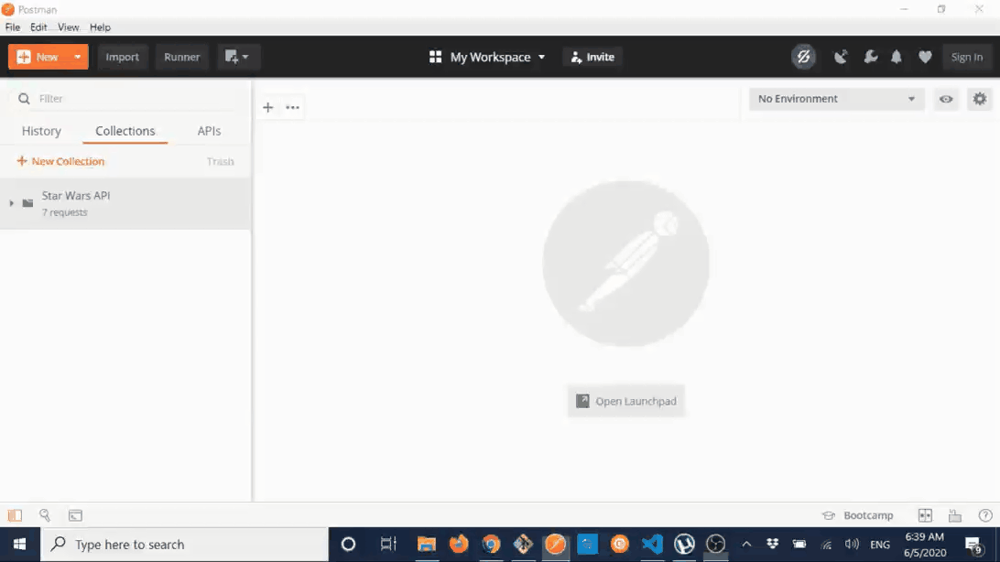

# DUMMY API
Just a dummy API to have a class about APIs.

## Collection setup in Postman
1. Install and open [Postman](https://www.postman.com/).
2. Import **dummy_api** collection and environment secrets into Postman.  
>**__Example__**  

3. The collection should be available now.

## App Installation for MACOS users.
### Installation
1. Install [`Python 3.7`](https://realpython.com/installing-python/) or higher.  
2. Install required python modules with the command: `pip install -r requirements.txt`.
3. Install **__gunicorn__**: `pip install gunicorn`.

### Execution
1. `cd` using the terminal to the root folder of the project.
2. Run command `gunicorn main:application --bind 127.0.0.1:8100` 
3. Start sending [requests](./collection) to the API in Postman.

## App Installation for WINDOWS users.
### Installation 
1. Install [`Python 3.7`](https://realpython.com/installing-python/) or higher.  
2. Install required python modules with the command: `pip install -r requirements.txt`.
3. Install **__waitress__**: `pip install waitress`.

## Execution
1. `cd` using the terminal to the root folder of the project.
2. Run command `waitress-serve --port=8100 main:application` 
3. Start sending [requests](./collection) to the API in Postman.

## Execution (only to debug in DEV Mode)
- MACOS: Run command `gunicorn main:application --bind 127.0.0.1:8100 --reload --timeout 500` instead.
- WINDOWS: Process explained [here](https://stackoverflow.com/questions/36817604/how-to-change-and-reload-python-code-in-waitress-without-restarting-the-server).

